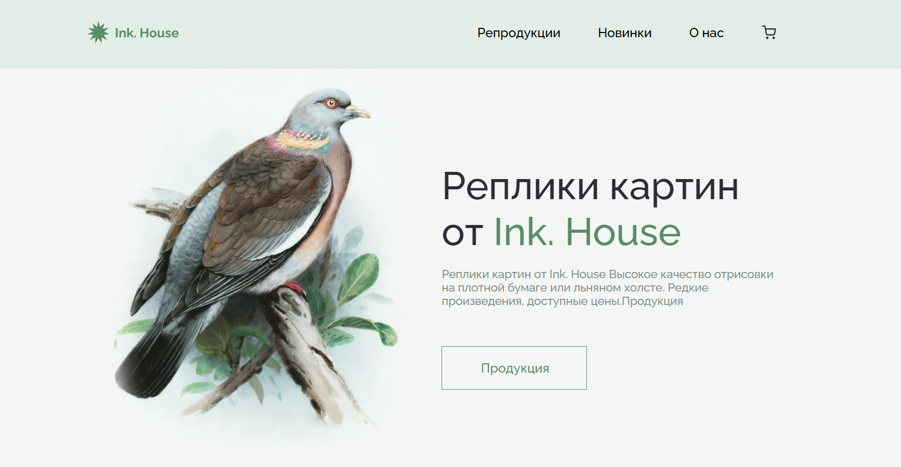
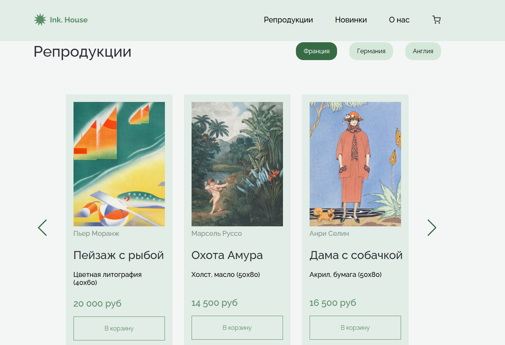
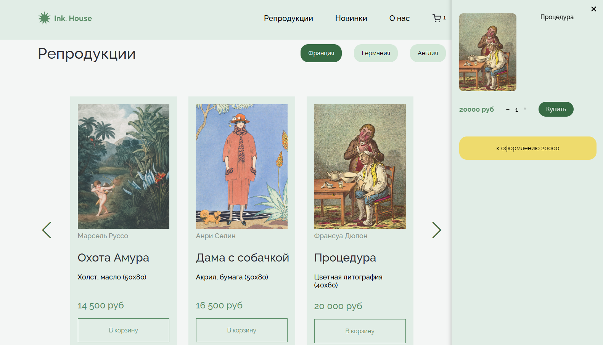

# 🖼 Ink. House — сайт галереи репродукций

Сайт галереи художественных репродукций с возможностью заказа и корзиной. Разработан на WordPress с использованием Elementor и кастомной темы.

---

## 📸 Превью

### Главный экран:

### Репродукции:

### Корзина:

---

## 🧰 Используемые технологии

- **WordPress** — CMS
- **Elementor** — визуальный редактор страниц
- **Кастомные Elementor-виджеты** — для вывода контента
- **Redux Framework** — для настроек Header и Footer
- **ACF (Advanced Custom Fields)** — размер и цена
- **JavaScript (без WooCommerce)** — собственная реализация корзины

---

## 🧩 Основные блоки

- **Главный экран** — с обложкой и описанием
- **Слайдер репродукций** — с фильтрами по странам
- **Карточки товара** — название, техника, цена, кнопка "В корзину"
- **Корзина** — добавление, счётчик, удаление, общая сумма

---

---

## ⚙️ Установка

1. Залей содержимое `themes/ink-house` в `wp-content/themes/`
2. Активируй тему в админке WordPress
3. Установи и активируй:
   - Elementor
   - Redux Framework
   - Advanced Custom Fields (ACF)
4. Создай страницу и собери её через Elementor с использованием кастомных виджетов

---

## 💬 Особенности

- Полностью кастомная реализация корзины **без WooCommerce**
- Гибкая структура карточек и фильтров
- Чистый код и аккуратный дизайн
- Динамический контент через ACF и опции темы через Redux

---

## 👤 Автор

Проект создан для портфолио.

---

